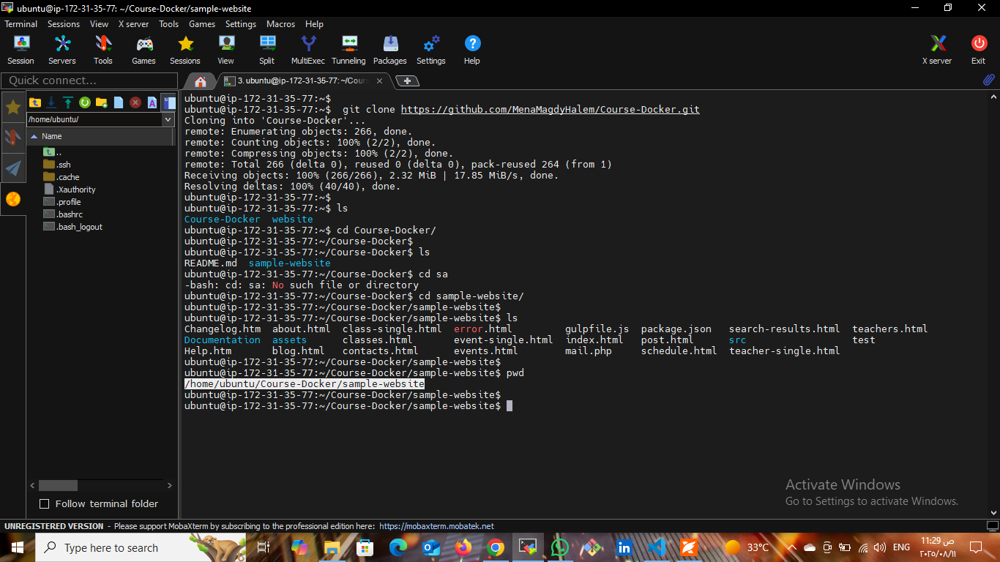
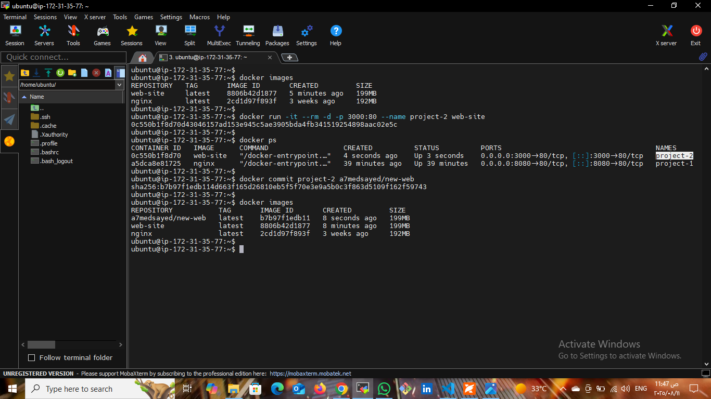

# Deploy Static Website using Nginx in Docker

## 📌 Project Description
This project demonstrates how to deploy a static HTML website using *Nginx* inside a Docker container.  
The HTML files are cloned from GitHub and served via Nginx, with the container accessible from the browser using a mapped port.  
The Dockerfile used for building the image is located at [codes/Dockerfile](codes/Dockerfile).

---

## 🖼 Architecture Diagram

---

## 🛠 Steps & Screenshots

### 1️⃣ Clone Website Files from GitHub
  
Cloned the website files from GitHub and displayed the repository contents.

### 2️⃣ Create a Dockerfile (Located at codes/Dockerfile)
  
Created a Dockerfile inside the codes/ folder to set up an Nginx container and copy website files to the correct directory.

### 3️⃣ Build the Docker Image
  
Built a custom Docker image from the Dockerfile.

### 4️⃣ Run the Docker Container
  
Started a container from the built image and mapped host port 3000 to container port 80.

### 5️⃣ Test in Browser
  
Accessed the website from a browser via localhost:3000 and verified it loaded correctly.

### 6️⃣ Create an Image from Running Container
  
Created a new Docker image from the running container.

### 7️⃣ Check Docker Hub (Before Push)
  
Verified that no images were available in Docker Hub before pushing.

### 8️⃣ Push Image to Docker Hub
  
Pushed the image to Docker Hub repository.

### 9️⃣ Check Docker Hub (After Push)
  
Confirmed that the image was successfully uploaded to Docker Hub.

### 🔟 Pull & Run from Docker Hub
  
Pulled the image from Docker Hub after deleting it locally and ran a new container.

### 1️⃣1️⃣ Final Browser Test
  
Confirmed the website still works correctly after pulling the image from Docker Hub.

---

## 🚀 How to Run This Project

### *Option 1 — Build from source*
1. *Clone the repository*
   bash
   git clone <repository-url>
   cd <project-folder>
   

2. **Navigate to the codes/ folder and build the Docker image**
   bash
   cd codes
   docker build -t my-nginx-website .
   

3. *Run the container*
   bash
   docker run -d -p 3000:80 my-nginx-website
   

4. *Access from browser*
   Open:  
   
   http://localhost:3000
   

---

### *Option 2 — Pull from Docker Hub*
1. *Pull the image*
   bash
   docker pull <your-dockerhub-username>/<your-image-name>
   

2. *Run the container*
   bash
   docker run -d -p 3000:80 <your-dockerhub-username>/<your-image-name>
   

3. *Access from browser*
   Open:  
   
   http://localhost:3000
   

----

## 👤 Author

Ahmed Sayed  
[LinkedIn](https://www.linkedin.com/in/ahmed-sayed-devops-cloud)  
[GitHub](https://github.com/ahmed-sayed-devops)

---

## 📜 License

This project is licensed under the MIT License - see the [LICENSE](LICENSE) file for details.
